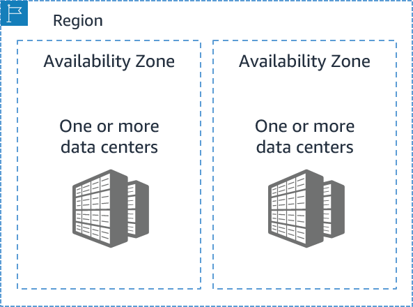

AWS Availability Zones

    - choosing an available region
        - Compliance
            - Company / application requires handling of data in a certain place
        - Latency     
            - How close your IT resources are to your user source
        - Pricing 
            - Pricing varies from region to region
        - Servicing availability
            - Some services aren't rolled to every region right away

    - Summary: 
        - Motivation: Redundancy
        - Definitions:
            - Data centers: inside availability zones
            - Availability zones: inside of regions

    - Other global infrastructure 
        - Global Edge Network
            - Edge locations / Regional Edge Caches
                - Cache resources closer to users 
                - Lowers latency
                - Example: Amazon Cloud Front
