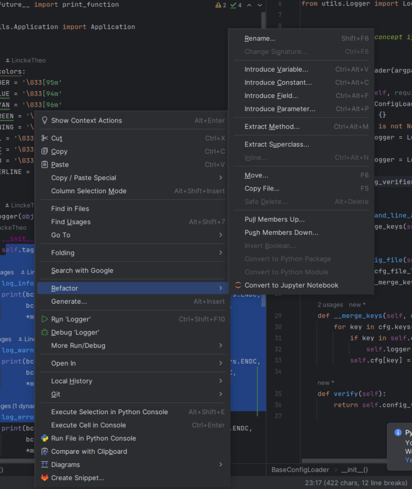

# General Refactoring

**Def:** Refactor _(verb)_: To modify a portion of code _without changing any of the underlying logic._

## Principles:
1. DRY (Don't repeat yourself)
    - Don't go overboard with this pattern and don't abstract before it becomes a problem. As a general rule of thumb, three strikes and you refactor:
        1. The first time you do something, you just do it. 
        2. The second time you do something similar, you wince at the duplication, but you do the duplicate thing anyway. 
        3. The third time you do something similar, you refactor.
2. [CLEAN code](https://www.amazon.com/Clean-Code-Handbook-Software-Craftsmanship/dp/0132350882): 
    - Slowly becoming more and more outdated and should be read with a scrutinous eye
3. SOLID - Not as relevant at face value when not using a structured class heirarchy:
    - Single Responsibility:
        - Make your classes do one thing and your functions shouldn't lie
    - Open Closed Principle
        - Make your code easy to extend, but hard to modify.
    - Liskov exclusion principle
        - You should be able to substitute any subclass for a parent class (not applicable much in this code base because there's not a strong class heirarchy)
    - Interface Segratation Principle
        - You should never be forced to use a certain implementation of an interface (also not applicable for the same reasons)
    - Dependency Inversion Principle
        - Depend on abstractions, not concretions (also not quite applicable)
4. YAGNI - You aren't gonna need it:    
    - Don't build software "just in case" - note it in a comment or ticket if you want
    - The less code the better
5. KISS - Keep it simple stupid:
6. Readability - More code is read than is written. 
    - Although not all code should be readable, it's a factor to take into consideration 
    - Readability and abstraction sometimes comes at the cost of performance / specificity
Yeah, this is cool:
```
while (*d++ = *s++);
```
But this is (arguably) better:
```
for(int i = 0; i < len; ++i){
    s[i] = d[i];
}
```
(You could argue the first example is better because one liners lead to less code - which is more readable, but the point remains)
    - Readability isn't just syntax. Code architecture and "cleanlieness" aids in readability, but there is a point of diminishing returns - e.g. over abstraction

7. Stateless vs Stateful code... Side effects
    - Attempt to avoid code state and side effects when possible:
        - [Here's more](https://www.defmacro.org/2006/06/19/fp.html)
        - Examples:
            - The fewer class attributes, (sometimes) the better
            - The fewer created files in your file system, (sometimes) the better
    

## Refactoring "Algorithms":

1. Test Refactor Test
    1. Capture the behavior of the block of code you're refactoring by writing an extensive set of tests. Make sure everything is passing before moving on.
    If the code is _bad_, meaning some tests should pass but fail, keep in mind that fixing these failures isn't technically refactoring. You are
    now introducing new logic to the code base. Use best judgement if you want to fix these failing tests or write a ticket to discuss the business value 
    2. Refactor
    3. Ensure tests are still passing - meaning you didn't change any of the original underlying logic

2. Complete Logical Extraction
    For pure refactors, use refactoring tools in your IDE:
    Example:


## "Code Smells":
**Def:** Code Smell _(noun)_: Common characteristics of code that indicate deeper problems
Won't reinvent the wheel: see [code smells](https://refactoring.guru/refactoring/smells). Also [Martin Fowlers Refactoring](https://github.com/willykraisler/prueba/blob/master/M.Fowler%20et%20al%20-%20Refactoring%20-%20Improving%20the%20Design%20of%20Existing.pdf) has a chapter on code smells.

## Other Cool Concepts
1. Cyclomatic Complexity:
    - How many linearly independent paths you can take through a function:

```python
if foo:
    if bar:
        if zeb:
            return 1
    if biz:
        if buz:
            return 2
...
```
has high cyclomatic complexity
```python
return 1
```
has low cyclomatic complexity
- Low cyclomatic complexity is an indicator of good use of single responsibility and readability, but isn't always the goal

2. Code Cohesion
```python
class Foo:
    def __init__(self):
        self.a = 1
        self.b = 2
        self.c = 3
        self.d = 4
    
    def biz(self):
        return self.a + self.b

    def buz(self):
        return self.c + self.d
```
Has low cohesion and can be refactored:

```python
class Foo:
    def __init__(self):
        self.a = 1
        self.b = 2
        
    def biz(self):
        return self.a + self.b
    
class Bar:
    def __init__(self):
        self.c = 3
        self.d = 4
    
    def buz(self):
        return self.c + self.d
```

See way more metrics here:
    - https://www.ndepend.com/docs/code-metrics
    
## My favorite resources:
1. [Martin Fowler](https://www.martinfowler.com/)
    - [Refactoring](https://github.com/willykraisler/prueba/blob/master/M.Fowler%20et%20al%20-%20Refactoring%20-%20Improving%20the%20Design%20of%20Existing.pdf)
2. [Refactoring GURU](https://refactoring.guru)
3. [NDepend Blog](https://blog.ndepend.com/?_ga=2.238033156.565627599.1711055437-938426994.1711055434)
4. [NDepend Metric Docs](https://www.ndepend.com/docs/code-metrics)