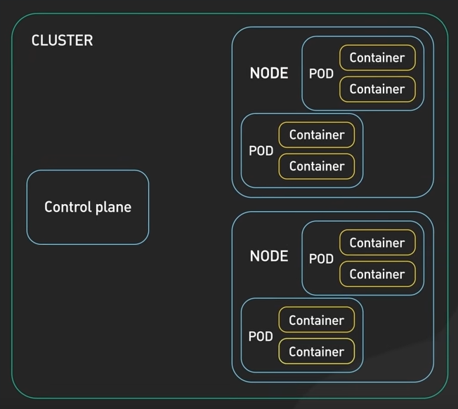

- Control Plane
    - Managing state of the cluster
    - Usually runs on multiple nodes on multiple data centers

- Worker Nodes
    - Physical or virtual machine
    - Contains services to run pods
    - Components:   
        - Kubelet
            - Daemon run on each node
            - Communicates with control plane
                - which pods to run
                - desired state is maintained
        - Container Runtime
            - Runs container on worker nodes
            - Managing container resources
        - Kube proxy
             - Routing traffic to the correct pods
             - Load balancing across pods
- Pods 
    - Abstraction of a container
        - Abstract away container runtime (technology - qemu, docker etc)
    - Suggestion: 1 "Application" per pod
    - Multiple containers
        - usually "helper containers" or "side services"
    - Host one or more containers
    - Shared storage and networking for those containers
    - Ephemeral - can die easily
    - Networking:
        - Each pod gets its own IP Address (reset every restart)

- Service 
    - Permanent IP Address attached to each pod
    - Lifecylce of service and pod are not connected (pod dies, service doesn't)
    - External Service
        - Opens communication from external sources
    - Internal Service 
        - E.g. don't expose database pod inside a node
    - Ingress
        - Forwards to service

- Control Plane
    - components:
        - Api Server
            - REST API for clients to interact with control plane
        - etcd
            - Key value store
            - Stores persistent state
        - scheduler
            - Scheduling pods under the worker nodes
        - controller manager
            - Running controllers that manage state of the cluster

- (component) Config Map
    - External config to application
        - URLS of database etc 
    - Non confidential data only
- (component) Secret
    - Like Config map, but stores secret data
    - Stored in base64 encoded, Not in plain text
    - Should be Encrypted using third party tools (K8s doesn't do this out of the box)