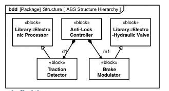
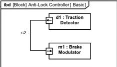

# Structure
    - Atomic unit of structure: `Block`
        - Something you would specify in your system
        - Has characteristics, values
        - Strong sense of hierarchy
        - Parts list

## Example:

### bdd: Block definition diagram
Defines blocks 

- Composition:
    - Anti Lock Controller is composed from:
        - Traction Detector
        - Brake Modulator
- Generalization / Specialization:
    - Traction Detector is a "kind of" Electronic Processor
    - Brake Modulator is a "kind of" Brake Modulator

### Internal Block Diagram
Diagram of "usage". Looks "inside" a block diagram

- d1 and m1 are attached by c2 with ports that allow information to flow in between them
