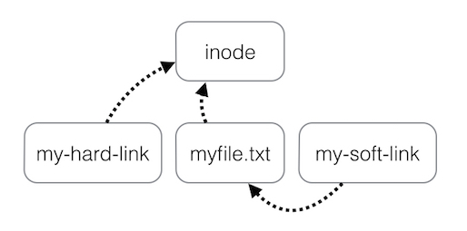

## Linux link files
```
ln - s <path to the _actual_ file> <path to the link to be created>
```
- -s: soft/symbolic (as upposed to hard link)



    - When to use:
        - **Usually you should use soft links**
        - Hard:
            - Pros:
                - Less space consumption
                - File reference counting
                    - You could do this:
                        `/docs/house/taxes/fx2015.pdf`
                        `/docs/taxes/2015/fx.pdf`
                        And point to the same data
                - Apparently this use case is good: http://www.mikerubel.org/computers/rsync_snapshots/#Incremental
            - Cons
                - Lots of applications, when saving a file:
                    - Create a new file and write to that file
                    - on success:
                        swap the new and existing file, delete the old file
                    - on failure:
                        data is left unchanged
                    - So now two file point to different files

## INodes
Basically just "the data" being stored (a collection of meta data that tells the computer where to find the data)
A File just points to the inode
