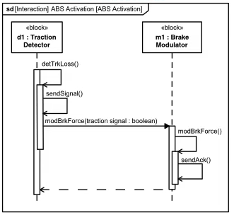
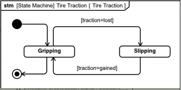
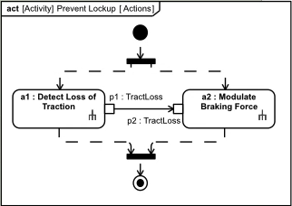

# Behavior

## Examples:

### Sequence Diagram
Elements of structure on lifelines

### State Machine
Block has states, and sub states

### Activity Diagram
- (earlier - functional flow diagram)
- Unconstrained behavior
- No structure

- two actions: a1 and a2 (behavior actions)
- Start state
- End state